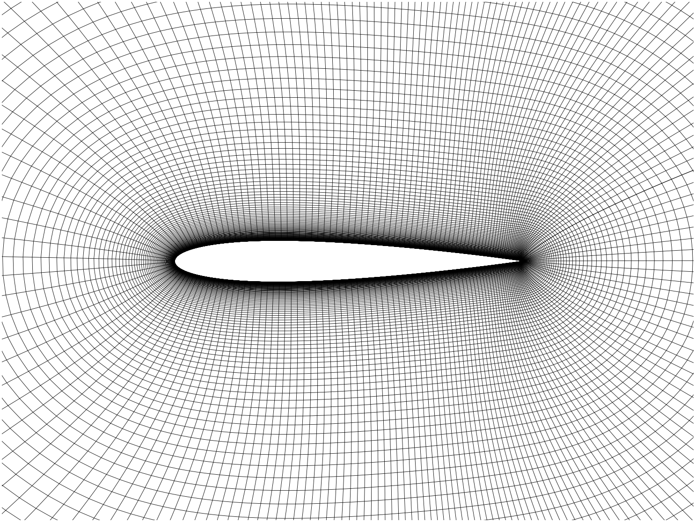
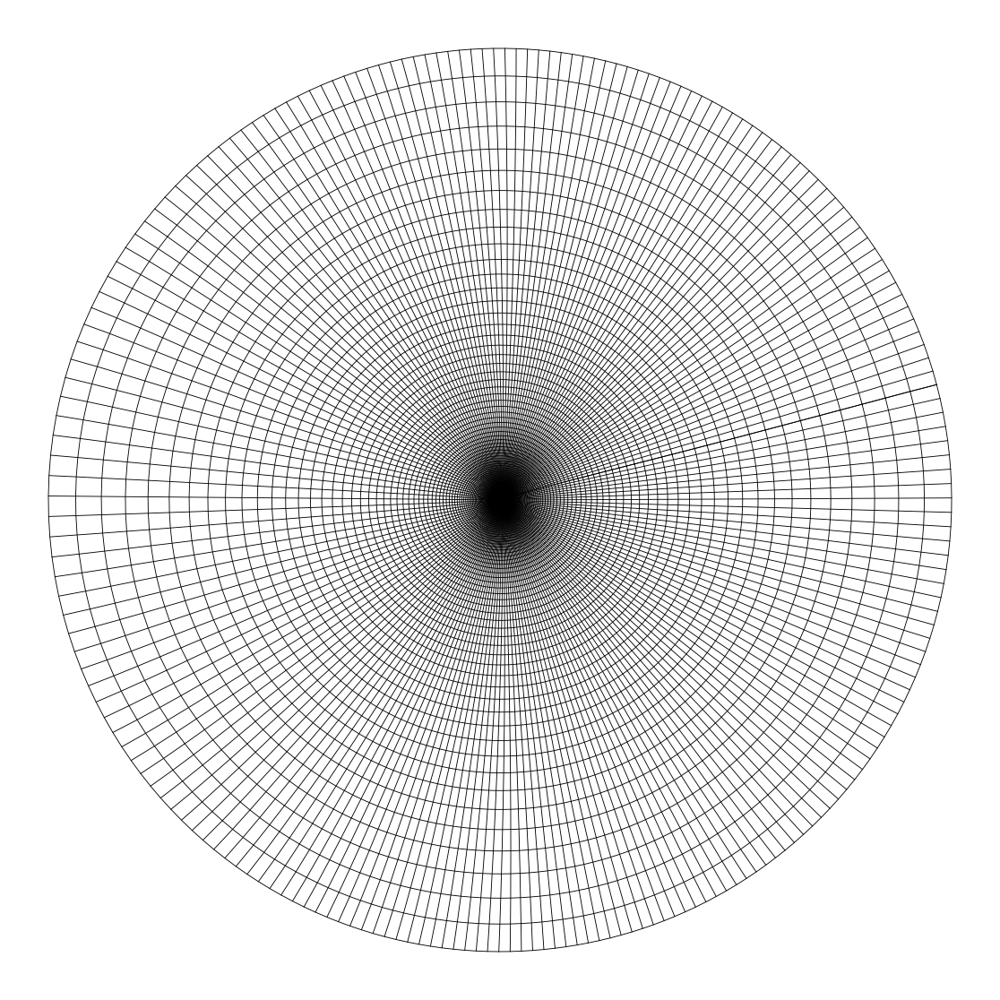
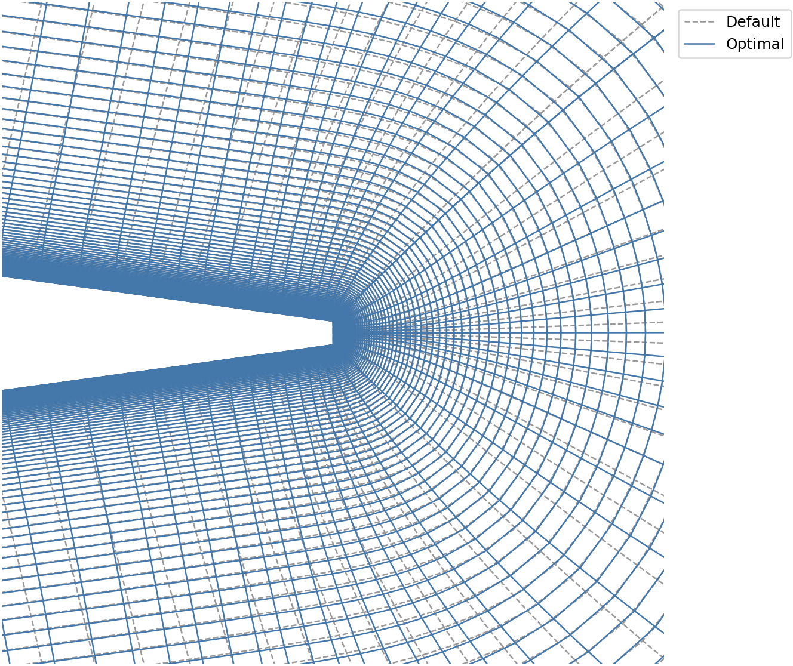

# GridFoil

GridFoil is a pure Python mesh generator for structured, two-dimensional
quadrilateral O-grids around sharp and blunt trailing-edge airfoils. It creates
a circular farfield, calculates the first-layer height from Reynolds number and
target y-plus, evaluates mesh quality, and exports solver-ready mesh files.

No external meshing executable or compiled GridFoil extension is required.

## Mesh examples

### Near field



### Full domain



### Default vs Optimal (Trailing Edge)



### Mesh-quality comparison

The values below come from the 210 × 210-node NACA0012 example.

| Compact metric | Default | Optimized |
|---|---:|---:|
| Cell count | 43,681 | 43,681 |
| Invalid cell count | 0 | 0 |
| Scaled corner Jacobian (minimum–maximum) | 0.67324–1.00000 | 0.72187–1.00000 |
| Cell orthogonal quality (minimum–maximum) | 0.25133–1.00000 | 0.42025–1.00000 |
| Dual orthogonality, degrees (minimum–maximum) | 62.850–90.000 | 76.040–90.000 |
| Neighbor area ratio (minimum–maximum) | 1.000–4.108 | 1.000–1.927 |
| Edge aspect ratio (minimum–maximum) | 1.004–2684.076 | 1.002–2851.741 |

## Architecture

GridFoil pipeline is as follows.

1. Read and normalize a Selig-format airfoil contour.
2. Prepare and redistribute the airfoil surface points.
3. March a structured O-grid from the wall to the farfield.
4. Apply wall-normal spacing and fit the circular outer boundary.
5. Evaluate mesh quality and write the requested output formats.

The optional optimizer evaluates a small number of mesh-setting variations using
defaults calibrated across a broad range of airfoil geometries. Users can override
the controls when a particular geometry or flow condition needs different spacing.

## Installation

GridFoil requires Python 3.11 or later.

```sh
git clone https://github.com/Jun-AE/GridFoil.git
cd GridFoil
python -m pip install .
```

## Python usage

```python
from gridfoil import generate_mesh

mesh, files = generate_mesh(
    "examples/naca0012/naca0012.dat",
    output_directory="mesh/naca0012",
    project_name="naca0012",
    write_su2_output=True,
)

print(files["su2"])
print(mesh.quality.compact_summary())
```

The default mesh uses 401 circumferential nodes, 251 wall-normal nodes, a
50-chord farfield radius, a target y-plus of 1, and a Reynolds number of 9
million. The default width distribution law is BERNSTEIN3. Two other options
are available, as shown below.

## Meshing controls

| Control | Default | Purpose |
|---|---:|---|
| `circumferential_node_count` | `401` | Nodes around each O-grid ring, including the repeated seam |
| `wall_normal_node_count` | `251` | Nodes from the wall to the farfield |
| `leading_edge_cell_length` | `0.001130001` | Leading-edge surface-cell length in chord units |
| `trailing_edge_cell_length` | `0.0005075471` | Trailing-edge surface-cell length in chord units |
| `trailing_edge_face_cell_count` | `19` | Cells across a blunt trailing-edge face |
| `farfield_radius_chords` | `50.0` | Circular farfield radius in chord lengths |
| `farfield_angular_bias` | `1.0` | Angular distribution bias at the farfield |
| `surface_point_mode` | `"REDISTRIBUTE"` | Redistribute surface points or preserve the input distribution |
| `spacing_method` | `"BERNSTEIN3"` | Surface-width distribution law |
| `geometry_conditioning_mode` | `"AUTO"` | Airfoil reference-curve conditioning mode |
| `geometry_deviation_tolerance_chords` | `0.0002` | Permitted conditioning deviation in chord units |
| `geometry_max_refinement_depth` | `10` | Maximum adaptive geometry-refinement depth |
| `wall_y_plus_target` | `1.0` | Target wall-adjacent cell-centre y-plus |
| `flow_reynolds_number` | `9.0e6` | Reynolds number used for first-layer sizing |
| `wall_reference_length_chords` | `1.0` | Reynolds-number reference length in chord units |
| `hyperbolic_normal_coupling` | `4.22` | Normal coupling during grid marching |
| `hyperbolic_implicit_smoothing` | `35.6` | Implicit smoothing strength |
| `hyperbolic_explicit_smoothing` | `0.69` | Explicit smoothing strength |
| `farfield_uniformity_weight` | `0.14` | Outer-layer uniformity weighting |
| `hyperbolic_area_smoothing_passes` | `46` | Target-area smoothing passes |
| `hyperbolic_max_pseudo_aspect_ratio` | `8.0` | Radial-to-surface spacing threshold for temporary substeps |

## Command-line usage

Generate the default SU2 mesh:

```sh
gridfoil examples/naca0012/naca0012.dat --output mesh/naca0012
```

Generate an optimized mesh in all supported formats:

```sh
gridfoil examples/naca0012/naca0012.dat --output mesh/naca0012 --optimize --su2 --cgns --msh --vtu
```

`python -m gridfoil` provides the same interface. Run `gridfoil --help` to see
the available mesh controls and output options.

## Included examples

Two complete examples generate an optimized 210 × 210-node mesh and write SU2,
CGNS, Fluent MSH, and VTU files. The images above show the blunt (NACA0012)
example.

Grid sizes always use `circumferential × wall-normal`, so here
`m × n = 210 × 210`, giving `(m - 1)(n - 1) = 209 × 209 = 43,681`
quadrilateral cells.

Blunt trailing edge (NACA0012):

```sh
python examples/example_naca0012_blunt_TE.py
```

Generated files are written to `examples/naca0012/`.

Sharp trailing edge (NACA4412):

```sh
python examples/example_naca4412_sharp_TE.py
```

Generated files are written to `examples/naca4412/`.

## Input and output

Input coordinates must be a continuous two-column `x y` contour in Selig order:
upper trailing edge, around the leading edge, then lower trailing edge. Sharp and
blunt trailing edges are supported; Lednicer format is not. GridFoil accepts
whitespace- or comma-separated finite coordinates, blank lines, and nonnumeric
heading lines before the first coordinate. At least five coordinate rows are
required. Once coordinate data starts, every nonblank line must contain a valid
coordinate, so remove inline or trailing comment lines before use.

Airfoil coordinates are not redistributed with GridFoil. Suitable Selig-format
files can be obtained from the original providers:

- [UIUC Airfoil Coordinates Database](https://m-selig.ae.illinois.edu/ads/coord_database.html)
- [AirfoilTools](https://airfoiltools.com/)

The providers' own terms and profile-specific attribution remain applicable.

Supported outputs are:

- SU2 mesh (`.su2`)
- CGNS mesh (`.cgns`)
- Fluent legacy ASCII 2D mesh (`.msh`) (Verified in Fluent 2024 R2 and StarCCM+ 2606)
- VTU mesh with quality fields (`.vtu`)

View the mesh in [ParaView](https://www.paraview.org/) or in a solver that
supports one of these formats.

## License

GridFoil is licensed under the GNU General Public License, version 3 or later.
See [LICENSE](LICENSE).
